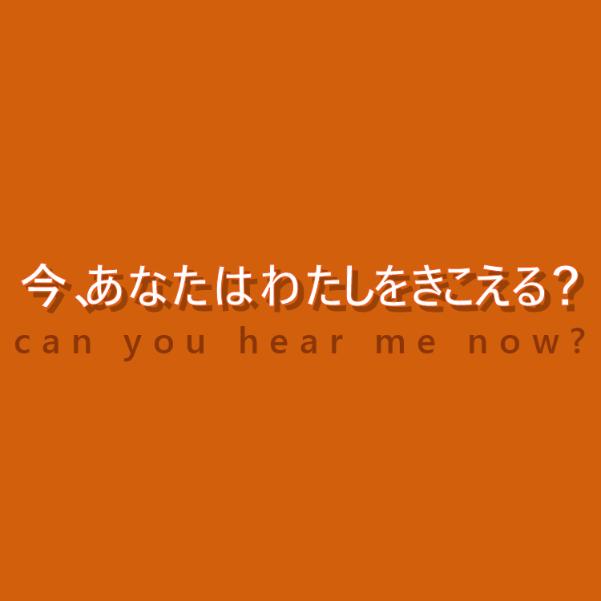
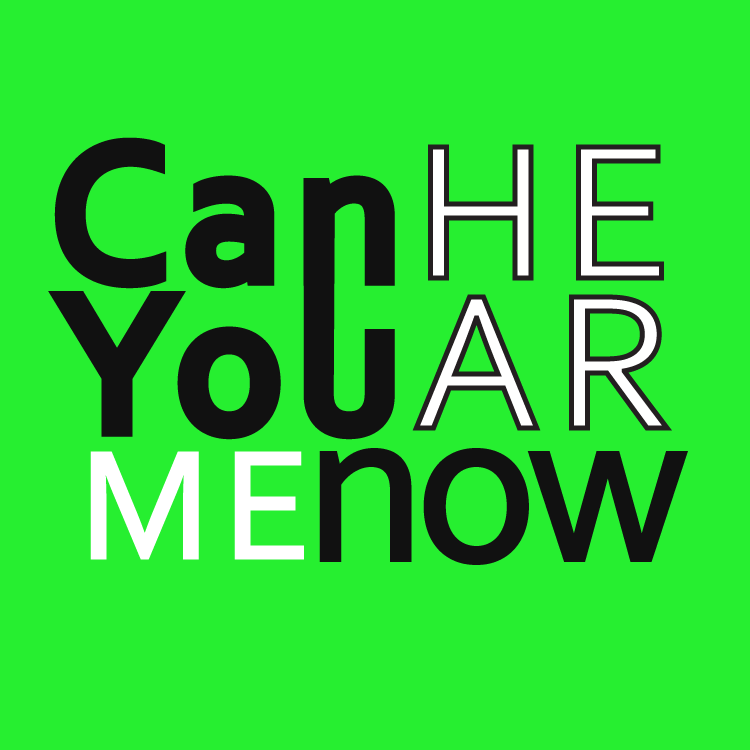
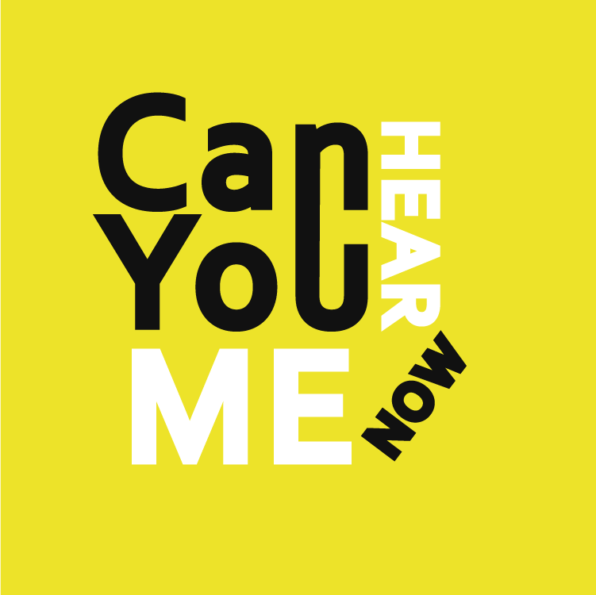
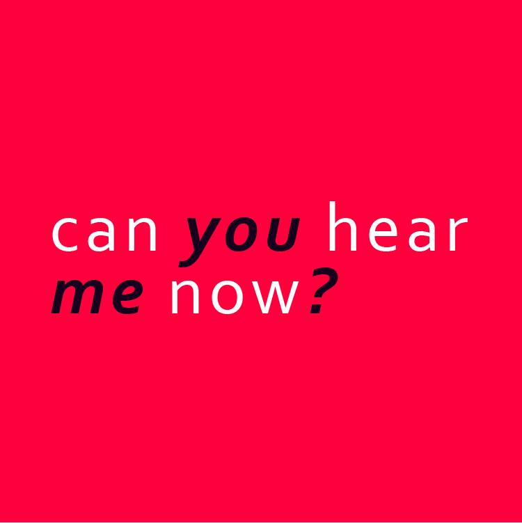
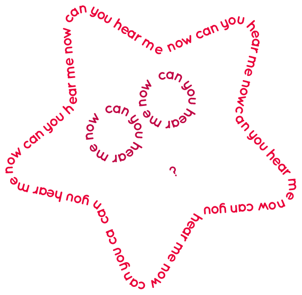
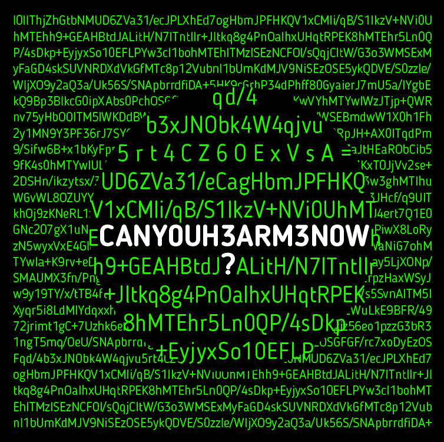
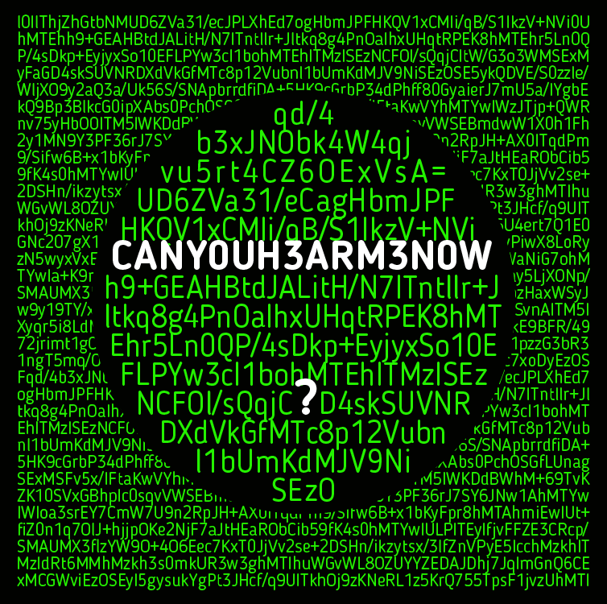

# OneTweet

For my OneTweet I chose to create a Typography composition of Demi Snowden's tweet "Can you hear me now?"
Initially I didn't actually know the origin of the tweet, causing my compositions to be based off of my own assumptions. I imagined that it had been tweeted by a bullied girl or just an upset/lonely individual who was crying out to be heard. 

I emphasized the "hear" as it is the word which holds the most information amongst the rest as the writer wanted to be heard.

Honestly, I didn't actually know what else to do with the tweet so I just went along and wrote it in Japanese text and added a few effects to emhance the overall appearance.

Here I manipulated the text and merged some of the "u" and "n" together to create an ear-like shape. I done this to add some relation to the word "hear" once again.

As you can probably already tell, this image is a mash-up of the one above it. I felt that the adjustments I made in the one with the green background were a little too harsh. So, I then changed the position of some of the text and removed the outlines to balance things out a bit.

I began to play around more, using italic and standard text. We were only able to use one font per composition so doing this allowed more visual variation.

This is my least favourite out of the 6. I tried to play around with the "Text on a path tool" which allows you to add text to the outside of a path. I tried to create a face out of the text - well the face of a starfish.

##Final

As you can see they both look pretty much the same with only minor adjustments. I chose this style as I did a little research on the original tweet and the publisher. I found out the Demi Snowden had committed treason and was now in Moscow. He released information to the public about encryption so I decided to make a composition inspired by the appearance of encrypted text.
